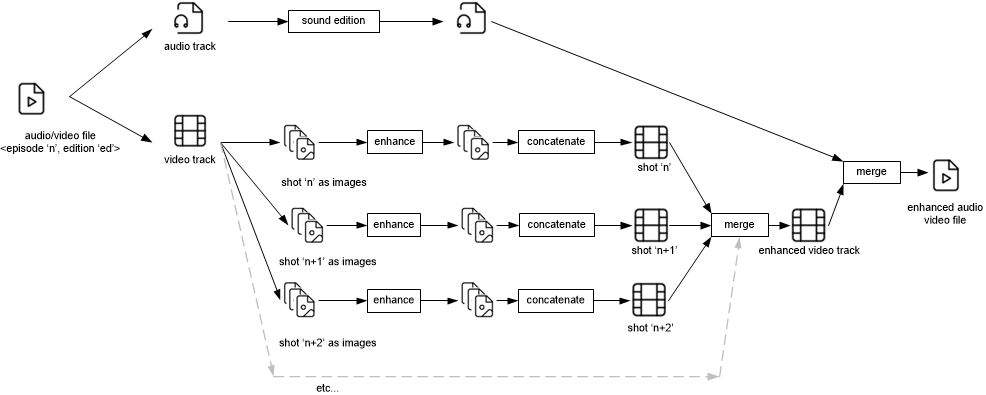

# How it works

## 1. Overview

## 2. Processing chain 

### 2.1. Audio
To generate the audio track, the script needs the following parameters:
- language: specified by command line or empty file (refer to [customization](customization.md))
- `[audio.<lang>]` section in each `ep##_target.ini` file

Temporary and generates files are stored in `cache\ep##\audio`

### 2.2. Video processing chain

### 2.2.1 Deinterlace 
The deinterlace process generates 'progressive' video files saved as temporary files in `cache\progressive` folder.

### 2.2.1 Enhance 

## 3. Video editing 
### 3.2. Languages 
### 3.1. A/V synchronization 
